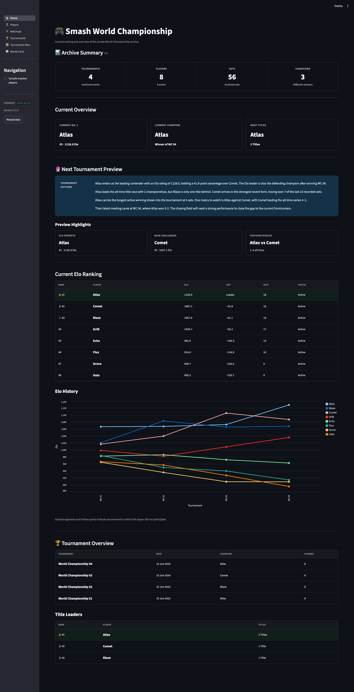
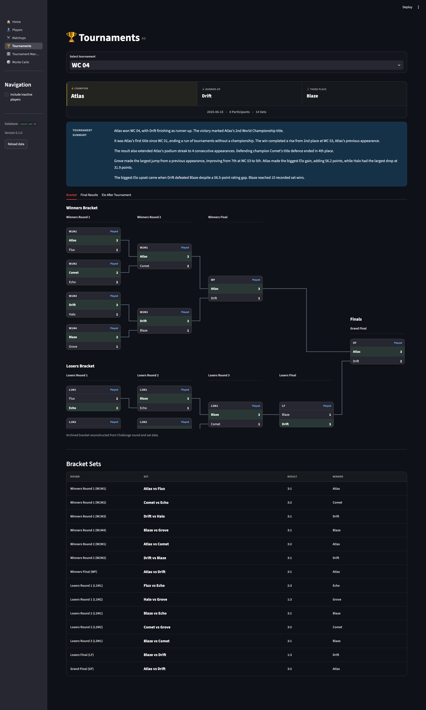
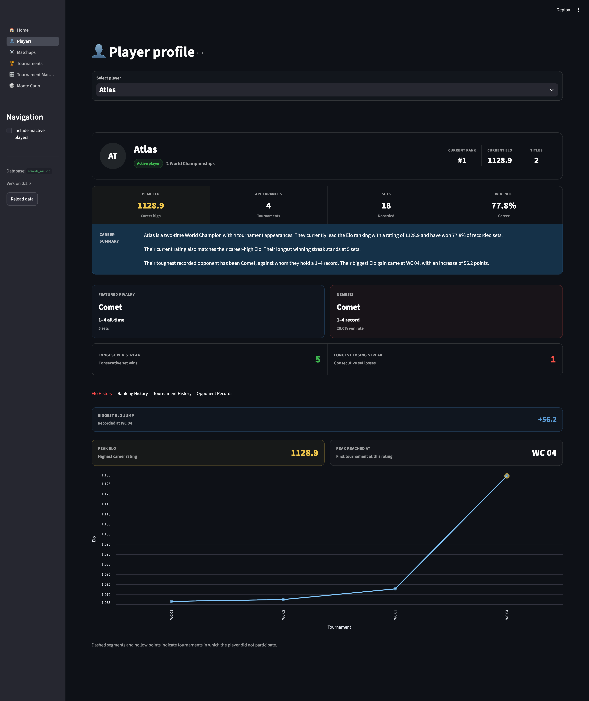
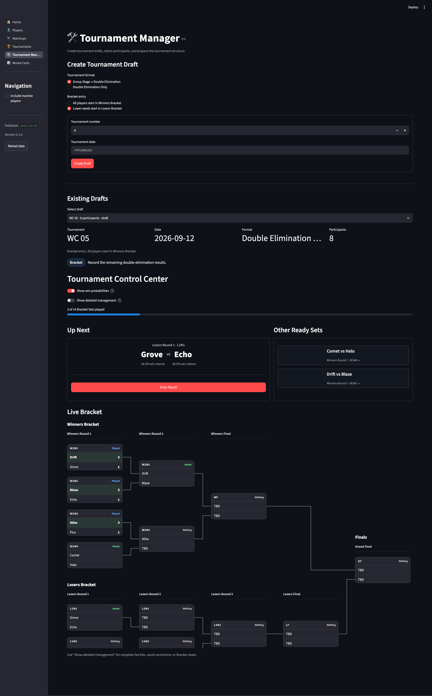

# Smash World Cup Manager

A private tournament operations and analytics platform for a recurring local
**Super Smash Bros. Ultimate** competition. It combines live tournament
management, historical statistics, player ratings and probabilistic forecasts
in one Streamlit application backed by SQLite.

The project was built for a real community workflow: organizers need to seed
players, run a tournament, correct results safely, understand who can still
qualify and publish the completed event into a persistent archive without
maintaining several disconnected tools.

## AI-assisted development

This project was developed with agentic AI tools as part of the engineering
workflow. They were used for tasks including implementation, test generation,
refactoring, debugging and documentation.

Product direction, tournament rules, model decisions, privacy boundaries and
acceptance criteria remained human-directed. AI-generated changes were reviewed
against the repository's documented rules, automated tests and manual UI
checks before acceptance. The repository intentionally states this because the
ability to direct, constrain and verify AI-assisted development is part of the
work demonstrated here.

## Product tour

All screenshots below use the repository's synthetic demo data. Select an
image to open the complete interface at full resolution.

| Analytics and player history | Archived competition |
|---|---|
| [](docs/screenshots/dashboard-overview.png) | [](docs/screenshots/archived-tournament.png) |
| **Dashboard overview** — archive health, rankings, narrative preview and rating trends | **Tournament archive** — podium, event recap, complete bracket and recorded sets |
| [](docs/screenshots/player-profile.png) | [](docs/screenshots/tournament-manager.png) |
| **Player profile** — career record, rivalries, streaks and rating progression | **Tournament Manager** — persisted draft, next playable sets, forecasts and live bracket |

## What the application does

The application covers the complete lifecycle of a tournament:

1. Create a draft and select 3–32 participants.
2. Seed players manually or from existing ratings.
3. Run a round-robin group stage, or start directly in a double-elimination
   bracket.
4. Record results while standings, bracket routes and forecasts update.
5. Handle byes, forfeits, corrections and a possible Grand Final Reset.
6. Preview final standings and rating changes before committing them.
7. Finalize the event into the shared archive used by rankings, profiles and
   head-to-head statistics.

The public-facing dashboard provides:

- current Elo rankings and rating history
- tournament archive, group tables, brackets and final standings
- player profiles, performance trends and placement distributions
- head-to-head records and matchup comparisons
- deterministic narrative summaries of notable results and trends
- live qualification, bracket and championship probabilities
- optional imports from Challonge for historical tournaments

## Tournament terminology

No competitive-gaming background is required to understand the workflow:

- A **set** is one complete encounter between two players. It contains several
  individual games.
- In a **round-robin group**, every player faces every other player in the same
  group.
- In **double elimination**, a first loss moves a player to the lower bracket;
  a second loss eliminates them.
- The undefeated finalist has not yet used their first loss. If the lower-
  bracket finalist wins the Grand Final, a **Grand Final Reset** decides the
  tournament in a second set.
- **Elo** is a rating system that updates player strength after each completed
  set based on the expected and actual result.

Supported formats are `Group Stage → Double Elimination` and
`Double Elimination Only`. Single elimination is intentionally not supported.

## Engineering highlights

### Stateful tournament workflow

Drafts, groups, matches and bracket progression are persisted in SQLite rather
than stored only in the UI session. Tournament finalization runs as one
transaction: if archival processing fails, player activation, standings,
matches and rating changes are rolled back together.

### Flexible bracket generation

The bracket engine supports 3–32 participants, automatically expands fields to
the next power-of-two bracket size and advances necessary byes. Players can all
start in the upper bracket or be split between upper and lower brackets based
on group-stage results.

### Consistent rules across live and archived data

The same canonical standings and Elo rules are used for live previews and
final archival calculations. Group-stage ties account for head-to-head mini
tables, game records, forfeits and unequal playing opportunities. Historical
Challonge tournaments remain compatible with nullable archive metadata.

### Live probabilistic forecasts

Monte Carlo simulations preserve completed results and simulate only unresolved
sets. The combined model represents dynamic player skill, regularized
head-to-head effects, deciding-game performance and tournament-day variation.
After a group stage, observed results inform a frozen day-performance estimate
for the bracket.

Forecast logic includes pre-tournament simulations, live single- and
multi-group qualification probabilities, bracket continuation and exact late
qualification-lock evaluation for the single-group path.

Private trained model artifacts are deliberately excluded from this
repository. Players missing from a local artifact receive a clearly labelled
neutral runtime prior; the stored artifact is never modified.

### Compatibility-focused modularization

Tournament, statistics and narrative functionality is organized into focused
packages while stable facade modules preserve existing imports. This allowed
large modules to be split incrementally without forcing application-wide API
changes.

## Architecture

```text
Streamlit pages
    │
    ├── Tournament Control Center
    │       ├── tournament workflow and bracket engine
    │       └── live Monte Carlo forecasting
    │
    ├── Archive, rankings, profiles and matchups
    │       ├── statistics and Elo services
    │       └── deterministic narrative generation
    │
    └── SQLite persistence
            ├── canonical archive tables
            └── tournament draft and live-state tables
```

| Area | Technology |
|---|---|
| Language | Python |
| Application UI | Streamlit |
| Persistence | SQLite |
| Data processing | pandas |
| Visualization | Altair |
| External import | Challonge API |
| Testing | `unittest` |

Primary modules:

```text
dashboard.py                 Streamlit entry point and navigation
src/dashboard_pages/         Public pages and tournament control UI
src/tournament/              Draft, group-stage, bracket and finalization logic
src/monte_carlo/             Model, simulations and live forecasts
src/smash_stats/             Elo, rankings, profiles, records and head-to-head
src/migrations/              Incremental SQLite schema changes
tests/                       Unit and UI-regression tests
```

## Run locally

Requirements: Python 3 and a virtual environment are recommended.

```bash
python3 -m venv .venv
source .venv/bin/activate
python -m pip install -r requirements.txt
python -m pip install -r requirements-dashboard.txt
```

Create a complete local demonstration with synthetic players, four archived
tournaments, an active bracket and a synthetic forecast model:

```bash
python examples/create_demo_database.py
```

Start the dashboard:

```bash
python -m streamlit run dashboard.py
```

The generator writes to the application's standard local paths and refuses to
overwrite existing data. Its `--replace` option is only for deliberately
disposable demo outputs.

For a private installation, copy `examples/seed.example.json` to
`data/private_seed.json`, replace its placeholders and run `python src/init_db.py`.

## Optional Challonge import

Copy the example environment file and add local credentials:

```bash
cp .env.example .env
```

Import a tournament:

```bash
python src/challonge_import.py wc_01 \
  --challonge-id YOUR_TOURNAMENT_SLUG \
  --replace
```

Manual corrections can be stored under `data/overrides/`. Credentials, raw
downloads and corrections are excluded from version control.

## Verification

The automated suite covers database initialization, tournament state,
round-robin standings, tie-breaks, bracket generation and progression,
transactional finalization, Elo, statistics, simulations, forecast edge cases,
narratives and responsive UI behavior.

```bash
PYTHONPATH=src python -m unittest discover -s tests -v
```

Additional validation commands for a populated private archive are:

```bash
python src/verify_all.py
python src/verify_import.py wc_01
```

## Data privacy

Real participant data and operational artifacts remain local. The following
are excluded through `.gitignore`:

- SQLite databases and backups
- private seed and tournament registry files
- Challonge credentials and raw downloads
- manual data corrections
- trained model artifacts

Only synthetic examples belong in `examples/` and in public screenshots.

## Current limitations

- A real two-player bracket set stored as `cancelled` is not simulated.
- Exact late qualification-lock evaluation is available for the single-group
  path. Multi-group probabilities are calculated jointly, but lock labels stay
  conservative while any group set remains unresolved.
- The separate Monte Carlo page is a lightweight planning and test surface;
  production forecasts are integrated into the Tournament Control Center.
